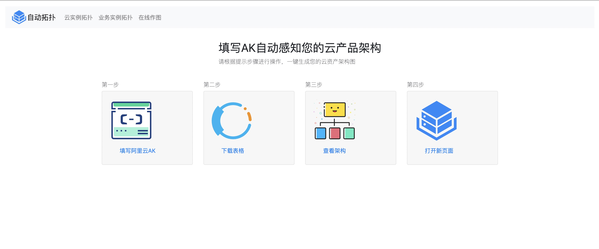
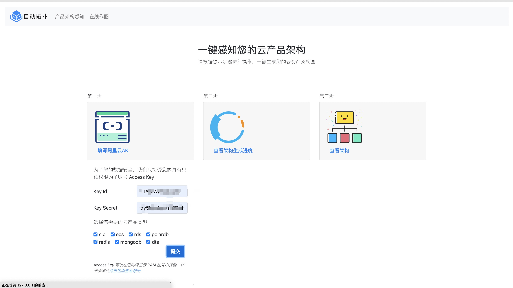
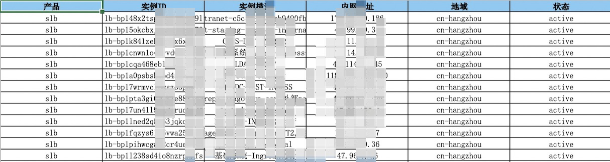
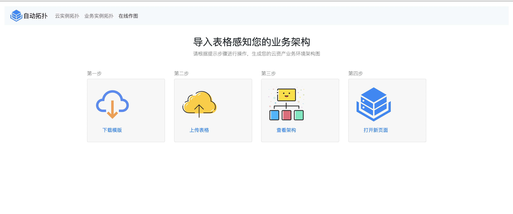
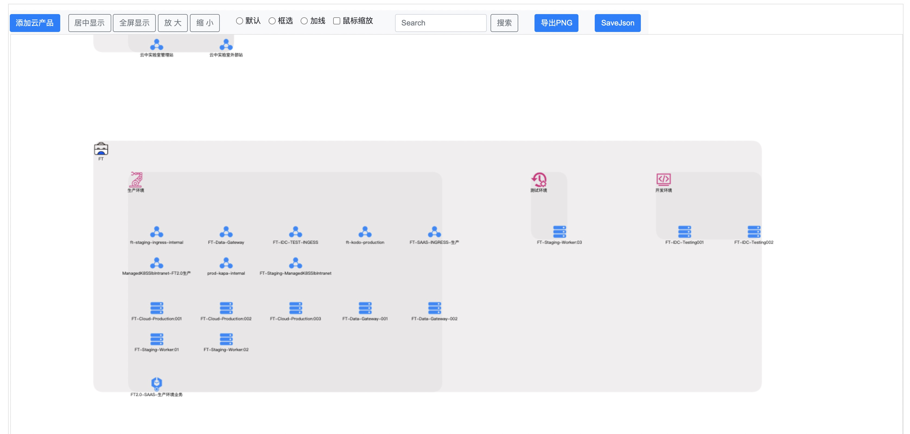

#  CloudTopo 

## 功能简介

### 第一期功能

* 周期：2020-07-30～2020-08-03
* 耗时：5个工作日

1. 手动绘图
2. 云实例拓扑
3. 业务实例拓扑

### 第二期功能

* 周期：2020-09-30～2020-10-15

1. 拓扑图中添加节点的详细信息


## 使用帮助

### 安装

1. 安装Python依赖关系包

```bash
# 创建python3的虚拟环境
yum install python-virtualenv
virtualenv -p `which python3`  venv
source venv/bin/activate
pip3 install --upgrade pip
pip3 install -r req.txt
```

2. 启动app程序

```bash
flask run
``` 

### 手动绘图功能


### 云实例拓扑功能

填写AK自动感知您的云产品架构






### 业务实例拓扑

导入表格感知您的业务架构





```bash
root@foundation0 cloudTopo]# virtualenv -p `which python3`  venv
[root@foundation0 cloudTopo]# source venv/bin/activate
(venv) [root@foundation0 cloudTopo]# pip3 install -r  req.txt
(venv) [root@foundation0 cloudTopo]# which flask
/alidata/cloudTopo/venv/bin/flask
```
